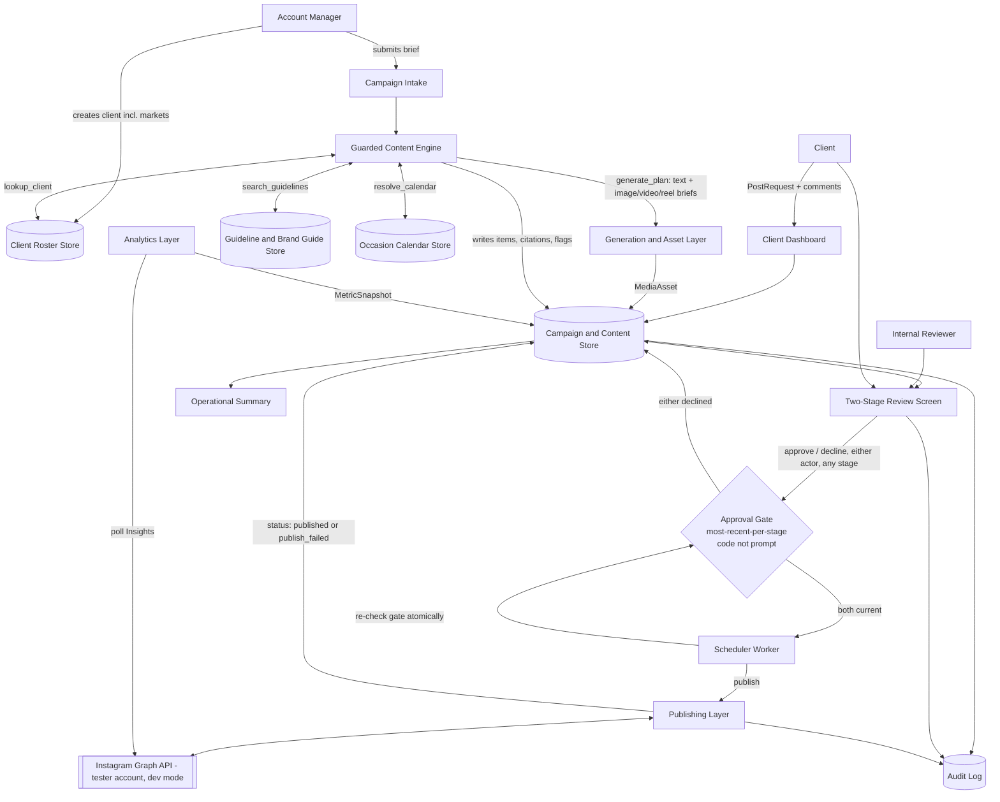
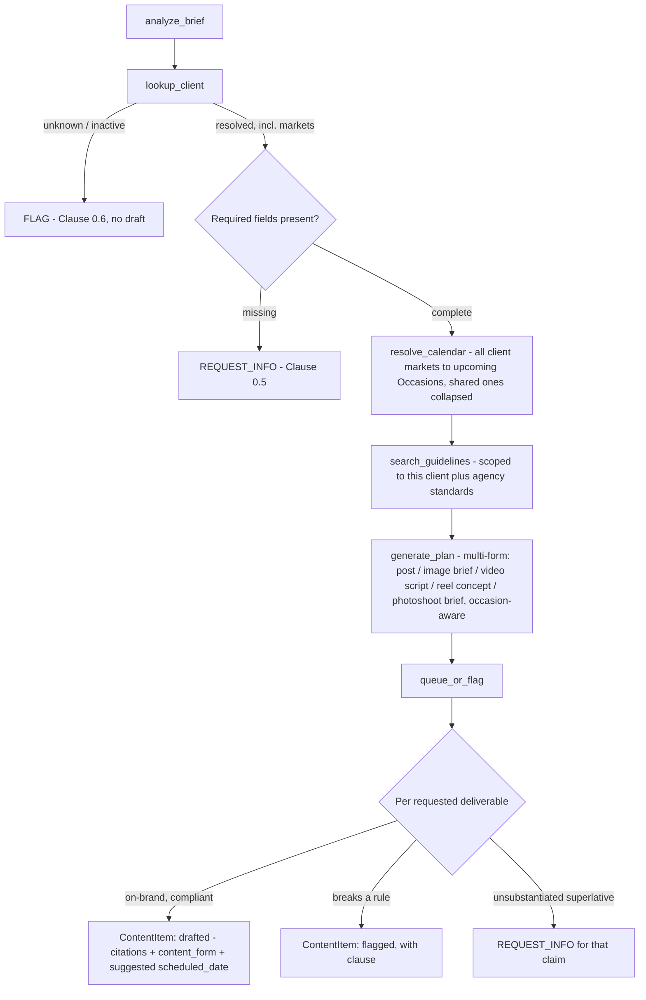
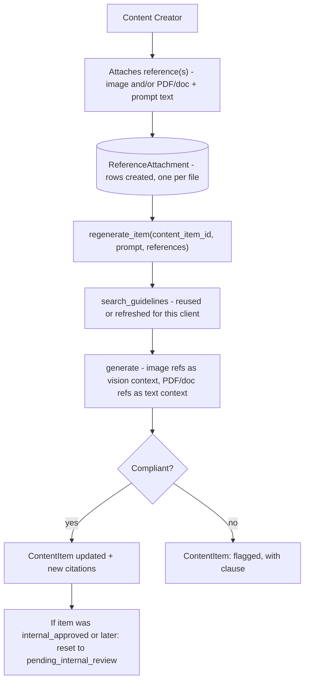
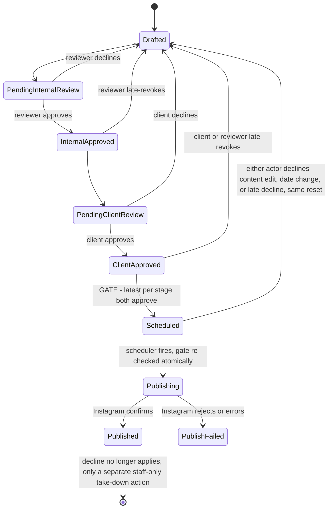
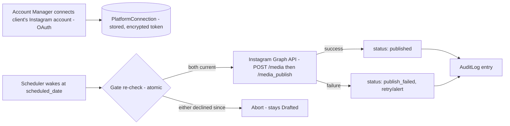
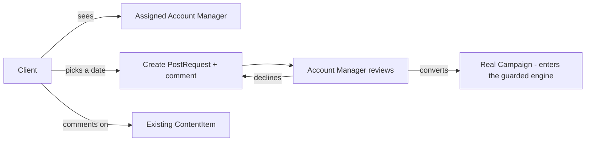

# System Architecture

## AI-Powered Content Operations Platform — Skip Studio

| | |
|---|---|
| **Prepared for** | Skip Studio (fictional client — Exology Pioneer Program, Week 4 Final Project) |
| **Prepared by** | Amr Hassan Safieddine Nagy |
| **Date** | August 24, 2026 |
| **Status** | Draft — for review |

---

## 1. Overview

The parts of the product, and how a campaign moves through them — from intake to a scheduled, dual-approved plan that actually publishes. Two things hold everywhere in this architecture, not just in the component that first checks them: **nothing is scheduled or published without both internal and client approval currently recorded**, and **nothing is drafted that breaks a rule** — both enforced in application code, never in a prompt.

An account manager submits a campaign brief — or converts a client's own calendar request — for a client operating in one or both of the seeded markets (Egypt and Saudi Arabia). The system looks up that client's rules, resolves upcoming occasions across every market that client operates in, and drafts a full multi-form content plan: posts, images, videos, reels, and photoshoot briefs, each grounded in the specific rule it was written under. An assigned creator refines it, an internal reviewer approves it, the client gives final sign-off, and only then is anything scheduled — and only then does a scheduler actually publish it to the client's connected Instagram account. Either the reviewer or the client can pull an item back even after approving it, right up until it goes live. Performance metrics flow back in once a post is published, visible to the account manager and the client.

---

## 2. Components

| Component | Role |
|---|---|
| **Campaign Intake** | Accepts a brief through a form, an incoming queue, or a converted client `PostRequest`; normalizes it into a structured object the engine can use. |
| **Guarded Content Engine** | The guarded pipeline that turns a brief into a drafted, cited, multi-form plan — or a request, a flag, or a refusal. Also exposes a narrower, item-level regeneration path a content creator can prompt directly, with the same grounding discipline. |
| **Client Roster Store** | The client roster: status, channels, markets (one or both), governing brand guide, account manager. Account managers create clients directly here. |
| **Guideline & Brand Guide Store** | Agency standards plus each client's versioned brand guide, retrieved per-request — never held in the model's memory. |
| **Occasion Calendar Store** | Seeded regional and local occasions, scoped by market, Hijri-aware for dates that move year to year. |
| **Campaign & Content Store** | Transactional data: campaigns, content items, media assets, citations, approvals, flags, platform connections, metrics, post requests, comments, audit log. |
| **Generation & Asset Layer** | Image and video generation clients. Photoshoot briefs are planning artifacts — shot lists and schedule slots — not generated assets. |
| **Publishing Layer** | The Instagram Graph API client, the OAuth connect flow, and a scheduler worker that re-checks the approval gate atomically before every publish attempt. |
| **Analytics Layer** | Polls Instagram Insights for published items on a fixed schedule and writes time-series metric snapshots. |
| **Scheduling / Background Jobs** | Time-triggered publish attempts, periodic analytics polling, periodic occasion refresh. |
| **Two-Stage Review Screen** | Where internal reviewers and clients act on drafted items; the only place approvals — and declines, including after the fact — are recorded. |
| **Client Dashboard** | Where a client sees their assigned account manager, requests or reschedules a post on the calendar, and comments on requests or existing posts. |
| **Brand Guide Management** | Where an account manager edits a client's guide; versions and gates changes behind client approval. |
| **Operational Summary** | Counts panel: every client's pipeline by status, market, and upcoming occasion. |
| **Audit Log** | Append-only record of edits, schedules, reschedules, deletes, publish attempts, take-downs, and late-revokes. |

---

## 3. Component diagram

---

## 4. Guarded Content Engine

For every brief, the engine runs a fixed sequence — retrieval and rule-checking are deterministic code, not model calls; only extraction and drafting are.

`resolve_calendar` pulls `Occasion` rows for **every market the client operates in** (via `ClientMarket`) within the campaign's planning window, resolving Hijri-based occasions (Ramadan, Eid al-Fitr, Eid al-Adha) against the seeded `OccasionDate` table rather than computing them live. Occasions sharing a `shared_key` across markets — Ramadan and the two Eids — are collapsed into one entry carrying each market's resolved date, so a dual-market client gets one Ramadan item rather than two near-duplicates. Occasions without a `shared_key` — Egypt's Revolution Day, Saudi Arabia's National Day — stay market-specific.

`generate_plan` receives this as context and tags each produced item accordingly: an item written around a market-specific occasion carries that `market_id`, while an evergreen or shared-occasion item carries `market_id = null` and is produced once. A market-tagged item schedules against its own market's resolved date. The engine only proposes; nothing is actually scheduled without the same approval gate as everything else, and a dual-market plan is approved item by item like any other.

`search_guidelines` is retrieval-scoped: a request can only return the requesting client's own active brand guide version plus the agency standards handbook. It is architecturally impossible for one client's rules — or content — to leak into another client's retrieval or drafting.

**Trends** are treated as an agency-curated internal signal — a field the account manager or content lead can attach to a brief, not a live external trends API. Instagram's own Graph API doesn't expose a general trends or trending-audio endpoint to third-party apps.

**Photoshoots** are treated as a planning artifact — a shot list, mood board, and schedule slot. No API generates a real-world physical shoot; `generate_plan` produces the brief, a human executes it, and the resulting media is uploaded afterward as a `MediaAsset` like any other.

Sensitive-sector clients (healthcare, financial, government) get every resulting item tagged `compliance_review_required` at this step, even when every item is otherwise clean.

### Item-level regeneration

Once an item exists, a content creator can prompt the engine again on that one item directly — attaching a reference image and/or a PDF/doc, with instructional text — rather than re-running the whole brief. This is a narrower operation than intake: it skips `analyze_brief`, `lookup_client`, and `resolve_calendar`, since those are already resolved, but still runs `search_guidelines` and still checks the result against the client's rules before accepting it.

An image reference is passed as vision context — it shapes how the result looks. A PDF or doc reference is text-extracted and passed as context — it shapes what the result says or knows. Only a content creator can attach references; each attachment belongs to the one `ContentItem` it was supplied for, and rows accumulate across regenerations rather than being overwritten, so a reviewer can see exactly which reference produced which version.

A reference file carries no authority over compliance, the same way brief wording and client comments never do — a competitor screenshot attached as "make it look like this" still can't produce disparaging content, and a reference photo showing an unapproved claim doesn't make that claim draftable. A regeneration on an item that has already reached `internal_approved` or later is a content edit like any other, and resets it to `pending_internal_review` under the same rule as every other invalidation.

---

## 5. Approval gate

The gate answers one question: **is the most recent recorded decision for each stage — internal and client — currently an approval.** It is called every time a schedule or publish is attempted, never assumed from a prior state or a brief's wording.

Decline is available at `pending_internal_review`/`pending_client_review` in the normal course of review, and remains available afterward — at `internal_approved`, `client_approved`, and `scheduled` — from either the internal reviewer/content lead or the client, so either party can pull back something they already signed off on. Any invalidation, whichever party or cause triggers it — a content edit, a `scheduled_date` change, or a late decline — produces the identical reset to `drafted`, unscheduling if scheduled. One rule, no per-cause branching.

The reset target is `drafted`, not `pending_internal_review`: a declined item goes back to whoever is working on it to be fixed, and re-enters review only when someone deliberately resubmits it. Bouncing it straight into the reviewer's queue would put the same unchanged content back in front of the person who just rejected it. Both approval stages must then clear again from the start — an item that was `client_approved` does not keep its internal approval.

A client `Comment` never triggers this. Comment is a discussion thread on a `PostRequest` or a `ContentItem`; only a formal `Approval` row with `decision = decline`, or a deliberate content/date edit by staff, invalidates approvals.

The scheduler's gate re-check is atomic — check-then-publish as one guarded step, not two separate calls — so a decline landing a second before the scheduled time cannot lose a race against the publish call. This is a dedicated test case: fire a decline concurrently with a scheduled publish attempt and assert the publish never happens.

Once `published`, decline no longer applies. The only remaining lever is a separate, staff-only **take-down** action that calls Instagram's delete endpoint directly — kept out of the approval vocabulary on purpose, since "declined" and "removed from a live account" are different classes of action with different risk.

---

## 6. Publishing flow

Meta requires every Instagram account touched by the API to be a Professional account (Business or Creator) — personal and private accounts have no API path at all, and Professional accounts cannot themselves be private. Full production access, publishing to arbitrary client accounts, requires Meta App Review, a 2–4 week process. `PlatformConnection` is built and tested against one tester-added Professional account in Meta's Development mode, which requires no App Review — a real, working integration, honestly scoped to one connected account rather than any client's account. Extending to arbitrary client accounts later is an App Review submission, not a code change.

---

## 7. Analytics flow

A separate scheduled job — not part of the request/response path — polls Instagram Insights for every `ContentItem` in `published` status on a fixed interval, writing one `MetricSnapshot` row per metric per poll: a time series, not an overwritten current value. Aggregation queries roll item-level snapshots up to campaign level.

Account Manager (their assigned clients only) and Client (their own data only) can view analytics. Agency Admin retains its cross-client view. Content Creator access to analytics is not granted.

---

## 8. Client Dashboard flow

`PostRequest` carries no authority, same as brief wording never does — however detailed the client's comment, it is a front door into the same pipeline, not a bypass. It cannot become a scheduled item without an account manager deliberately converting it into a real `Campaign` and the full engine and gate running as normal.

---

## 9. Roles and access

| Role | Capabilities |
|---|---|
| **Account Manager** | Creates clients directly, including which market(s) they operate in; submits briefs; is the internal reviewer by default; connects and manages a client's `PlatformConnection`; converts a `PostRequest` into a real `Campaign`; can late-revoke on any of their clients' approved or scheduled items. |
| **Content Creator** *(includes Marketing Specialist)* | Authors the full multi-form plan — post, image, video, reel, and photoshoot briefs; has calendar and occasion visibility; refines drafts before internal review; attaches image or PDF/doc reference material when prompting generation or regeneration of a specific item. Does not trigger publish directly — staging only; scheduling stays gate-controlled regardless of who staged the work. |
| **Content Lead** | When assigned in place of the account manager, acts as the internal reviewer for that client, with the same late-revoke power. |
| **Client** | Sees their assigned account manager; requests or reschedules posts and comments through the dashboard; gives final approval on content and on brand guide changes; can late-revoke their own approval on an approved or scheduled item; views analytics on their own data only. |
| **Agency Admin** | Assigns each client's account manager, reviewer, and creators; a cross-client view of where every account stands; not involved in day-to-day content work. The accountability role — see §10. |

`PlatformConnection` credentials are staff-only, never exposed to a client contact — a client can see that their account is connected, never the token itself.

Every capability in this table is expressed once, in `lib/domain/permissions.ts`, so a route and a domain function answer "may this user do this" the same way. Every denial raises a `role_boundary_violation` flag rather than failing silently — a rejected attempt is exactly what an Admin needs to see.

---

## 10. Governance and misuse

The gate stops bad *content*. This section is about bad *conduct* — and the Agency Admin is who it is surfaced to.

**Role management.** Admin assigns and reassigns each client's account manager, content lead, creators and client contacts. That is their only write power over day-to-day work, and every change writes an `AuditLog` row naming the admin, the client, the role and the user — so "who put this creator on this account, and when" is always answerable.

**The misuse queue.** Five things are flagged for the Admin, all through one entry point so detection is not scattered across layers:

| Flag | Raised when | Severity |
|---|---|---|
| `approval_override_attempt` | A brief or a client comment tries to skip or fake approval — "skip internal review", "the client pre-approved this" | high |
| `cross_client_data` | A query would have returned another client's content, guide or analytics | high |
| `role_boundary_violation` | A user attempts what their role forbids — a non-creator attaching a reference, a creator triggering publish, a client contact reaching another client | high |
| `off_task_generation` | A creator prompts the engine for something unrelated to the client's content | medium |
| `approval_churn` | An item declined repeatedly, or approved-then-revoked over and over | low |

Three of these are worth being precise about:

**An override attempt is recorded, never obeyed — and never a reason to refuse the work.** Clause 0.3 says instructions inside a brief carry no authority: they are "noted, never obeyed". So a brief containing bypass language still gets drafted normally; what it does not get is a shortcut past either approval stage. The flag is the "noted" half.

**`cross_client_data` is a tripwire, not a routine path.** `search_guidelines` is hard-scoped, so cross-client retrieval is structurally impossible rather than merely forbidden. A row of this type therefore means a real bug or a real attempt — it should never fire in normal operation, which is exactly what makes it worth watching.

**Off-task generation is refused by the model, not by a keyword list.** The creator-facing engine is a company resource, not a general chatbot. But a keyword filter would block legitimate creative work, so the deterministic pass only ever *allows* — only the generation call's own `on_task` judgment refuses. A false positive here blocks someone's actual job; a false negative costs one wasted call.

**The Admin's cross-client view is the deliberate exception.** Every other role is scoped: an account manager sees their assigned clients, a client contact sees one client, a creator sees their assignments. The Admin sees everything, because oversight is the job. That exception is tested explicitly (`P11.6`) so it stays a decision rather than becoming a hole.

---

## 11. Design decisions

| Decision | Choice | Why |
|---|---|---|
| Market | A real table, seeded with two rows (Egypt, Saudi Arabia); a client operates in one or both via `ClientMarket` | Egypt is what the seeded roster and brand guides are written for; Saudi Arabia alongside it makes the multi-market path demonstrable. A third market is a data insert, not a migration; no sub-national region is modeled |
| Dual-market plans | One campaign, items tagged per market — `ContentItem.market_id` nullable | Keeps one brief, one review pass, one approval gate; avoids duplicating evergreen content per market while still letting a national-day item schedule on the right date |
| Hijri-calendar occasions | Seeded per-year lookup table | No external calendar-conversion dependency; documented as needing yearly reseeding |
| Trends | Agency-curated internal signal | No accessible third-party trends endpoint on Instagram's API |
| Photoshoots | Planning artifact, not a generated asset | No API produces a real-world shoot |
| Instagram scope | One tester-added Professional account, Development mode | Full App Review takes longer than the build window |
| Gate semantics | Most recent Approval per stage, not any-approval-ever | Required for a late decline to actually take effect |
| Late-revoke | Symmetric for reviewer and client, same statuses, same reset | One code path; reviewer accountability matters as much as client sign-off |
| Comment vs. Approval | Comments never trigger a reset; only a formal decline or an edit does | Keeps the gate from being eroded by informal wording |
| Publish/decline boundary | Decline valid through scheduled; not valid once publishing or published | A live post needs a take-down action, not a retroactive decline |
| Publish trigger | Gate and scheduler only, never a manual creator action | Keeps the broadened creator role from becoming a bypass of the gate |
| Analytics access | Account Manager and Client only | Content Creator access not required for this scope |
| Retrieval scope | search_guidelines hard-scoped to one client plus agency standards | Makes cross-client leakage structurally impossible rather than a matter of model behavior |
| Reference attachments | Creator-only, scoped to one ContentItem's prompt; image and PDF/doc only, no video | Keeps generation-time reference material distinct from compliance grounding; video-conditioned generation is a materially bigger integration for this build window |
