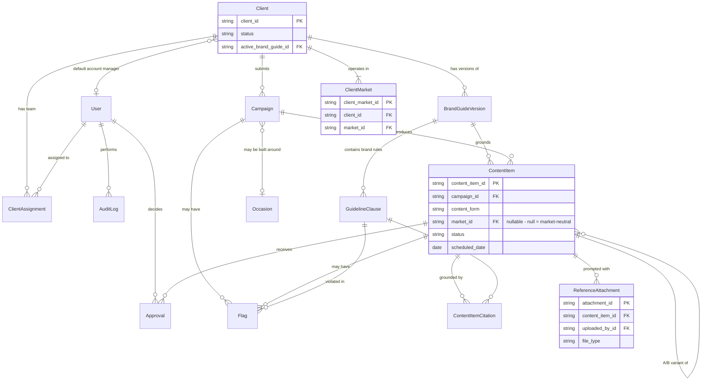
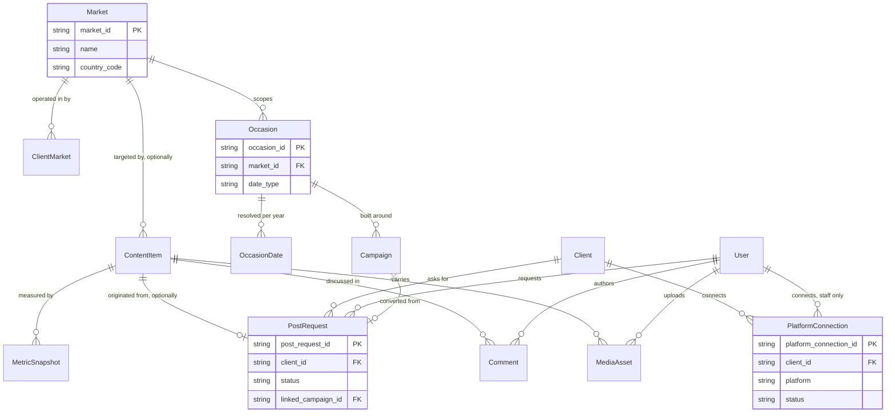

# Data Schema (ERD)

## AI-Powered Content Operations Platform — Skip Studio

| | |
|---|---|
| **Prepared for** | Skip Studio (fictional client — Exology Pioneer Program, Week 4 Final Project) |
| **Prepared by** | Amr Hassan Safieddine Nagy |
| **Date** | August 24, 2026 |
| **Status** | Draft — for review |

---

## 1. What this describes

The things the product stores: clients and the market they operate in, the people who work on them, the brand and compliance rules that govern their content, the regional calendar their content plans around, the campaigns and every multi-form deliverable they produce, the two-stage approval history behind each one, the Instagram account each client is connected through, the performance data that comes back once something is live, and the requests and comments a client raises directly. Built for full traceability: every scheduled item can be traced back to the brief it came from, the client and market it belongs to, the brand guide version it was grounded in, the rule it cited, and the exact approval history that cleared it to publish.

---

## 2. Entities

### People & access

**User**
| Field | Notes |
|---|---|
| `user_id` PK | |
| `name` | |
| `email` | unique; the login identifier |
| `password_hash`, nullable | null until the account is activated — a client contact created by their account manager has no password yet. Hashed, never reversible; never leaves the server. |
| `user_type` | `staff` \| `client_contact` |
| `is_agency_admin` | staff only; assigns roles on client records |
| `must_change_password` | true after an OTP redemption, forcing a password set before anything else is reachable |
| `status` | `invited` \| `active` \| `disabled` — `invited` means created but never signed in |
| `last_login_at`, nullable | |

> Every role signs in; there is no anonymous route. A client contact is created by their account manager rather than self-registering, so the account exists before its owner ever sees it — hence `password_hash` nullable and `status = invited` as the starting state.

**LoginOtp** — the one-time code that activates an invited account
| Field | Notes |
|---|---|
| `otp_id` PK | |
| `user_id` FK → User | |
| `code_hash` | hashed like a password — a leaked table must not hand over working codes |
| `expires_at` | short-lived |
| `consumed_at`, nullable | set on redemption; a code works exactly once |
| `created_by_id` FK → User | the account manager who issued it, for the audit trail |

> The code is displayed **on screen to the account manager** at creation and never stored in readable form. There is no email integration in this version (PRD §4), so the AM passes it on by whatever channel they already use with that client. It grants nothing by itself: redeeming it only unlocks setting a password.

**Session** — a signed-in user
| Field | Notes |
|---|---|
| `session_id` PK | the opaque token, stored hashed |
| `user_id` FK → User | |
| `expires_at`, `created_at` | |
| `revoked_at`, nullable | set on sign-out |

> Server-side sessions rather than a self-describing token, so a sign-out or a disabled account takes effect immediately. Every request derives the acting user from here — never from a query parameter or header the browser controls.

**ClientAssignment** — per-client team, beyond the default account manager
| Field | Notes |
|---|---|
| `assignment_id` PK | |
| `client_id` FK → Client, `user_id` FK → User | |
| `role_on_client` | `content_lead` (replaces account manager as reviewer) \| `content_creator` \| `client_approver` |

> A `client_approver` User may have exactly one `ClientAssignment` row, ever. Staff roles are intentionally many-to-many with Client; a client contact is not.
>
> Enforced by a **partial** unique index — `(user_id) WHERE role_on_client = 'client_approver'` — not by a plain unique on `user_id`, which would also forbid a content creator working across several accounts. The model-level `@@unique([client_id, user_id, role_on_client])` does not express this rule on its own: it permits the same contact to approve for CL-101 *and* CL-102, since those rows differ by `client_id`. That is the cross-client hole the invariant exists to close, so the index is declared in raw SQL (Prisma's schema language cannot express a filtered index) and `lib/domain/clientContactInvariant.ts` enforces the same rule with a readable error.

### Clients & markets

**Client** — the client roster
| Field | Notes |
|---|---|
| `client_id` PK | |
| `name`, `industry` | |
| `status` | `active` \| `inactive` — gates whether any content may be produced |
| `tier` | informational only, no behavior tied to it |
| `channels` | list |
| `account_manager_id` FK → User, nullable | default internal reviewer for this client; null for former clients with no active owner (e.g. CL-109) |
| `active_brand_guide_id` FK → BrandGuideVersion, nullable | null = no governing guide on file — the common case: only 8 of the 150 seeded clients have one |
| `sensitive_sector` | derived from industry (healthcare / financial / government) |

> A client's markets are **not** a column here — see `ClientMarket`. A client operates in one or more markets, chosen by the account manager at creation.

**Market** — seeded with two rows
| Field | Notes |
|---|---|
| `market_id` PK | |
| `name` | "Egypt" \| "Saudi Arabia" |
| `country_code` | EG \| SA |
| `calendar_system` | informational — e.g. "gregorian_and_hijri" |

> A real table rather than a hardcoded enum, so a third market is a data insert, not a migration. Egypt is the market the seeded roster and brand guides are written for (NileFit's audience is "Cairo and Alexandria"; agency Clause 1.3's worked example is "Egypt's leading"). Saudi Arabia is seeded alongside it so the multi-market path is demonstrable rather than theoretical.

**ClientMarket** — which markets a client operates in
| Field | Notes |
|---|---|
| `client_market_id` PK | |
| `client_id` FK → Client, `market_id` FK → Market | unique together |

> Every client has at least one row. The account manager picks one or both at client creation, and may change the set later. This is what makes a market a many-to-many rather than a column, without a schema change when a third market is added.

### Brand governance

**BrandGuideVersion**
| Field | Notes |
|---|---|
| `brand_guide_version_id` PK | |
| `client_id` FK → Client | |
| `version_number` | |
| `status` | `draft` \| `pending_client_approval` \| `active` \| `superseded` |
| `created_by_id` FK, `client_approved_by_id` FK, nullable | |
| `created_at`, `approved_at` | |

> Only one version per client is ever active. Past versions stay superseded, never deleted.

**GuidelineClause** — the agency standards and every client's brand rules
| Field | Notes |
|---|---|
| `clause_id` PK | |
| `source_type` | `agency` \| `brand` |
| `brand_guide_version_id` FK, nullable | null for agency clauses — global, unversioned |
| `clause_code`, `title`, `text` | e.g. `0.6`, `CR.4`, `NB.4` |

### Calendar

**Occasion** — regional and local calendar entries, scoped to one market
| Field | Notes |
|---|---|
| `occasion_id` PK | |
| `market_id` FK → Market | |
| `name`, `category` | e.g. "Ramadan"; religious \| national \| seasonal \| retail |
| `shared_key`, nullable | set when the same observance exists in more than one market — e.g. `ramadan`, `eid_al_fitr`. Lets the engine recognise Egypt's and Saudi Arabia's Ramadan rows as one occasion and produce a single market-neutral item, instead of two near-duplicates. National days have no `shared_key` and stay market-specific. |
| `date_type` | `fixed_gregorian` \| `hijri_based` |
| `month`, `day` | used only when date_type = fixed_gregorian |

**OccasionDate** — resolved per-year dates for occasions whose Gregorian date moves
| Field | Notes |
|---|---|
| `occasion_date_id` PK | |
| `occasion_id` FK → Occasion | only populated for hijri_based occasions |
| `year`, `gregorian_date` | the resolved date for that year |
| `source` | `seeded` — hand-maintained, not calculated |

### Campaigns & content

**Campaign** — the brief, and the campaign it becomes
| Field | Notes |
|---|---|
| `campaign_id` PK | |
| `client_id` FK → Client | |
| `title`, `objective`, `audience`, `channels`, `raw_brief_text` | as submitted |
| `related_occasion_id` FK → Occasion, nullable | set when built around a specific upcoming occasion |
| `submitted_by_id` FK → User | |
| `status` | `received` \| `info_requested` \| `in_progress` \| `complete` |
| `override_attempt_detected` | true if the brief tried to skip or fake approval |
| `compliance_review_required` | true for sensitive-sector clients |

**ContentItem** — one row per drafted deliverable
| Field | Notes |
|---|---|
| `content_item_id` PK | |
| `campaign_id` FK → Campaign | |
| `content_form` | post \| image \| video \| reel \| photoshoot \| email \| blog_post \| ad_copy \| hashtag_set \| cta \| creative_prompt |
| `platform` | instagram \| tiktok \| facebook \| linkedin \| email |
| `content_body` | current draft text; visual/video forms carry content via linked MediaAsset rows instead |
| `market_id` FK → Market, nullable | null = market-neutral (evergreen or shared-occasion) item, produced once; set = item written for that one market's occasion and scheduled against that market's date. Must be a market the client operates in. |
| `scheduled_date` | target/proposed publish date — distinct from the scheduled status |
| `status` | drafted \| in_refinement \| pending_internal_review \| internal_approved \| pending_client_review \| client_approved \| scheduled \| declined \| flagged \| publishing \| published \| publish_failed |
| `flagged_clause_id` FK, nullable | primary rule broken, if flagged |
| `parent_content_item_id` FK, nullable | self-reference for A/B variants |
| `grounded_brand_guide_version_id` FK | version active at draft time — frozen even if the guide is edited later |
| `created_at`, `updated_at` | |

**ContentItemCitation**
| Field | Notes |
|---|---|
| `citation_id` PK | |
| `content_item_id` FK, `clause_id` FK | |

> Every drafted item can be grounded in more than one clause — an agency clause and a brand rule together.

**MediaAsset** — generated or uploaded images and video
| Field | Notes |
|---|---|
| `media_asset_id` PK | |
| `content_item_id` FK → ContentItem | |
| `asset_type` | image \| video |
| `generation_source` | ai_generated \| uploaded — a photoshoot's output is always uploaded |
| `storage_url`, `format` | |
| `created_by_id` FK → User | |

**ReferenceAttachment** — reference material a creator supplies when prompting generation or regeneration of one item
| Field | Notes |
|---|---|
| `attachment_id` PK | |
| `content_item_id` FK → ContentItem | the specific deliverable being generated or regenerated |
| `uploaded_by_id` FK → User | must resolve to role_on_client = content_creator |
| `file_type` | image \| pdf \| doc |
| `storage_url` | |
| `instruction` | optional text accompanying the file, e.g. "match this angle" |
| `created_at` | |

> Image references are passed as vision context; PDF/doc references are text-extracted as context. Rows accumulate across regenerations rather than being overwritten. Carries no authority over compliance, same as brief wording and comments.

### Review & compliance

**Approval** — one record per decision, per item, per stage
| Field | Notes |
|---|---|
| `approval_id` PK | |
| `content_item_id` FK → ContentItem | |
| `stage` | `internal` \| `client` |
| `decision` | `approve` \| `decline` — an approval that requests a change is recorded as decline |
| `comment` | required if decline, optional if approve |
| `decided_by_id` FK → User, `decided_at` | |
| `bulk_action_id`, nullable | groups rows created by one "approve whole plan" click |

> The gate reads the most recent row per `(content_item_id, stage)` — not whether an approval exists anywhere in history. This is what lets a reviewer or client decline something they already approved. Decline is available at `pending_internal_review`/`pending_client_review`, and remains available at `internal_approved`, `client_approved`, and `scheduled`, for either the internal reviewer/content lead or the client. Decline stops applying once `publishing` or `published`.

**Flag** — anything routed to a human instead of drafted or scheduled
| Field | Notes |
|---|---|
| `flag_id` PK | |
| `campaign_id` FK, `content_item_id` FK, nullable | null content_item_id = brief-level flag |
| `clause_id` FK, nullable | the rule broken — null for the governance types, which breach a role boundary rather than a clause |
| `flag_type` | **content:** brand_violation \| compliance_violation \| unknown_client \| inactive_client — raised by the engine, about the work **governance:** cross_client_data \| approval_override_attempt \| role_boundary_violation \| off_task_generation \| approval_churn — raised anywhere, about a person's conduct, surfaced to the Agency Admin |
| `severity` | `high` (a real breach: override attempt, cross-client access, role violation) \| `medium` (off-task generation) \| `low` (approval churn — a process signal, not a rule breach). Lets the Admin queue rank breaches above noise. |
| `raised_against_id` FK → User, nullable | who did it, for the governance types. Null for engine-raised content flags, which are about a brief, not a person. |
| `resolved`, `resolution_notes`, `resolved_at` | |

> Two kinds of flag share one table because both are "route this to a human". They differ in who reads them: a content flag goes to the account manager handling that brief, a governance flag goes to the Agency Admin. `severity` and `raised_against_id` are what the Admin's misuse queue sorts and groups on.
>
> `cross_client_data` is a tripwire, not a routine path: retrieval scoping makes cross-client access structurally impossible, so a row here means a real bug or a real attempt, and is always `high`.

**AuditLog** — append-only
| Field | Notes |
|---|---|
| `audit_id` PK | |
| `entity_type`, `entity_id`, `action` | created \| edited \| scheduled \| rescheduled \| deleted \| approved \| declined \| flag_raised \| flag_resolved \| published \| take_down |
| `details`, nullable | free-form JSON context for the action — what changed, and from what to what |
| `performed_by_id` FK → User, `performed_at` | |

### Publishing & performance

**PlatformConnection** — a client's connected Instagram account
| Field | Notes |
|---|---|
| `platform_connection_id` PK | |
| `client_id` FK → Client | |
| `platform` | instagram (enum kept open for future platforms) |
| `access_token` | encrypted at rest — never stored or logged in plaintext |
| `platform_account_id`, nullable | Instagram's own account id; safe to display to a client, unlike the token |
| `token_expires_at`, nullable | drives the `expired` status |
| `status` | connected \| expired \| disconnected |
| `connected_by_id` FK → User, `connected_at` | staff only |

> No privacy field — Instagram Professional accounts cannot be private, so there is nothing to model.

**MetricSnapshot** — time-series, not a single mutable row
| Field | Notes |
|---|---|
| `metric_snapshot_id` PK | |
| `content_item_id` FK → ContentItem | |
| `captured_at`, `metric_type`, `value` | impressions \| reach \| likes \| comments \| shares \| saves |

### Client requests

**PostRequest** — the client-initiated calendar ask; carries no authority
| Field | Notes |
|---|---|
| `post_request_id` PK | |
| `client_id` FK, `requested_by_id` FK → User (client_contact) | |
| `requested_date` | the calendar day being asked for |
| `related_content_item_id` FK, nullable | set for "change/reschedule this existing post" |
| `status` | new \| under_review \| converted \| declined \| withdrawn |
| `linked_campaign_id` FK, nullable | set once converted into a real brief |

> A request is editable and withdrawable **by the client who raised it, while it is still `new`** (PRD §6). The account manager takes it by moving it to `under_review`, and that is the moment the client's edit controls switch off — an explicit action rather than a side effect of the AM opening the page, so both sides can see exactly when the request stopped moving.
>
> `withdrawn` is a distinct status rather than a reuse of `declined`, because the two are different facts: `declined` is the agency saying no, `withdrawn` is the client changing their mind. Collapsing them would make the AM's queue unable to tell the two apart. A withdrawn row is kept rather than deleted — its `Comment` thread is part of the client's conversation with their account manager.

**Comment** — discussion thread, distinct from `Approval.comment`
| Field | Notes |
|---|---|
| `comment_id` PK | |
| `post_request_id` FK, nullable | exactly one of these two is set |
| `content_item_id` FK, nullable | |
| `author_id` FK → User, `body` | |

> A Comment never triggers an approval reset — only a formal Approval decline or a deliberate edit does.

---

## 3. PRD roles → schema representation

Five user types, none with a dedicated table — each is a `User` plus, for client-scoped roles, a `ClientAssignment` row. This is what lets Admin assign or reassign anyone by editing a row, with no separate user-management screen.

| Role | user_type | role_on_client | Sees | Notes |
|---|---|---|---|---|
| **Account Manager** | `staff` | — (Client.account_manager_id) | Clients they manage | Submits briefs; is the internal reviewer unless a content lead is assigned; creates clients and their client contacts; manages PlatformConnection; converts PostRequests. |
| **Content Creator** *(incl. Marketing Specialist)* | `staff` | `content_creator` | Clients they are assigned to | Zero or more per client; authors the full multi-form plan; refines drafts pre-internal-review; attaches image/PDF/doc references when prompting generation or regeneration. |
| **Content Lead** | `staff` | `content_lead` | All clients | Optional per client; replaces the account manager as internal reviewer for that client, with the same late-revoke power. Reviews across accounts, so unlike the creator their view is not scoped by assignment. |
| **Client** | `client_contact` | `client_approver` | Their own client only | One or more per client. Created by their account manager and activated with a one-time code. Approves/declines via the same Approval table, stage = client. Sees their assigned account manager; raises PostRequests and Comments; views their own analytics. |
| **Agency Admin** | `staff`, admin=true | — | All clients | Not tied to any one client; edits account_manager_id on Client and rows in ClientAssignment directly. The accountability role: the only reader of the governance `Flag` queue and the only role that can change who works on what. Every assignment change they make writes an `AuditLog` row naming them. |

> Two roles see every client — the Content Lead, because reviewing spans accounts, and the Agency Admin, because oversight is the job. The other three are scoped, and the scope is derived from the signed-in user on every request rather than from anything the browser supplies.

---

## 4. Relationship diagram — client, campaign & content

## 5. Relationship diagram — market, publishing & client requests

---

## 6. Traceability

| Requirement | Satisfied by |
|---|---|
| Choose market — one or both of Egypt and Saudi Arabia | `Market` table seeded with two rows + `ClientMarket` join, set by the account manager at client creation |
| A dual-market client's plan covers both | `ContentItem.market_id` nullable — market-neutral items produced once, occasion-specific items produced per market |
| Regional and local occasion calendar | `Occasion` + `OccasionDate`, scoped by market_id, Hijri-aware, `shared_key` collapsing observances common to both markets |
| Full multi-form content plan | `ContentItem.content_form` + `MediaAsset` |
| Schedules refer to upcoming events and occasions | `resolve_calendar` engine step + `Campaign.related_occasion_id` + `scheduled_date` |
| Publish to Instagram | `PlatformConnection` + Publishing Layer, scoped to one tester account |
| Performance analytics for Account Manager and Client | `MetricSnapshot`, time-series, role-scoped queries |
| Account Manager creates clients with market | Client create flow, market_id required |
| Client sees assigned account manager | Direct read of Client.account_manager_id |
| Client calendar request/schedule with comments | `PostRequest` + `Comment`, no authority over the gate |
| Edited approved or scheduled post resets approval | ContentItem.status reset on content or scheduled_date change |
| Client and reviewer can decline after approval or scheduling | Approval, gate reads most-recent-per-stage, symmetric for both actors |
| Nothing scheduled or published without both current approvals | Atomic gate re-check in the scheduler — dedicated race-condition test |
| A published post cannot be silently declined | status = published excluded from decline; separate take-down action |
| No client's content or guide visible to another client | Every content-bearing table scoped by client_id via campaign_id → Client, filtered by `visibleClientIds(user)` derived from the session |
| Creator can attach reference files for content generation | `ReferenceAttachment`, scoped to one content_item_id, creator-only, image/PDF/doc only |
| Every role signs in; a client contact is created for them | `User.email` / `password_hash` / `status`, `LoginOtp`, `Session` — account manager issues a one-time code, client redeems it and sets a password |
| Access differs by role | Client → own client; Account Manager → `account_manager_id` matches; Content Creator → `ClientAssignment` rows; Content Lead and Agency Admin → all clients |
